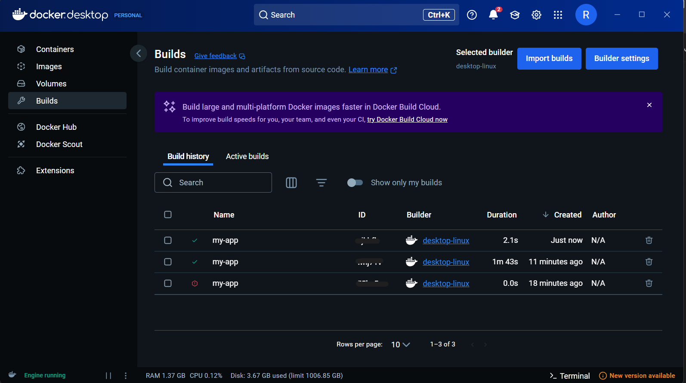
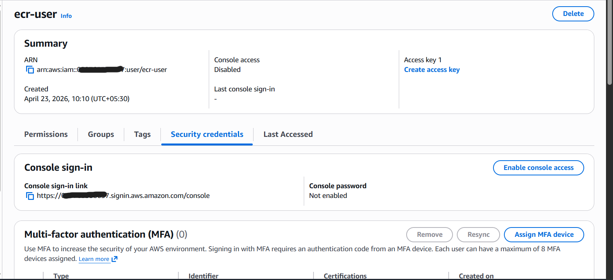
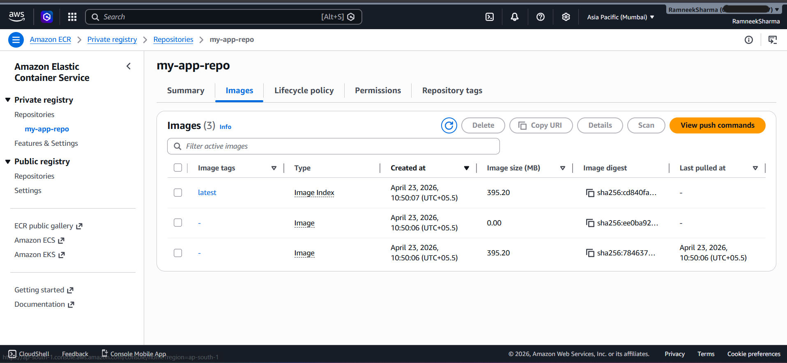

## 📷 Screenshots

### 🐳 Docker Build

### 📦 ECR Repository

### 🚀 Image in ECR

This is a practice project demonstrating how to build a Docker image and push it to AWS ECR.

## 🔧 Steps Performed
- Created Docker image using Dockerfile
- Created AWS ECR repository
- Authenticated Docker with AWS CLI
- Tagged Docker image
- Pushed image to AWS ECR

## 🛠️ Technologies Used
- Docker
- AWS ECR
- AWS CLI

## 📌 Commands Used

### Build Image

docker build -t my-app .

### Login to ECR

aws ecr get-login-password --region ap-south-1 | docker login --username AWS --password-stdin <account-id>.dkr.ecr.ap-south-1.amazonaws.com

### Tag Image

docker tag my-app:latest <account-id>.dkr.ecr.ap-south-1.amazonaws.com/my-app-repo:latest

### Push Image

docker push <account-id>.dkr.ecr.ap-south-1.amazonaws.com/my-app-repo:latest

## 📷 Output
Image successfully pushed and verified in AWS ECR console.

---

📌 This project is created for practice and learning purposes.# docker-ecr-project
